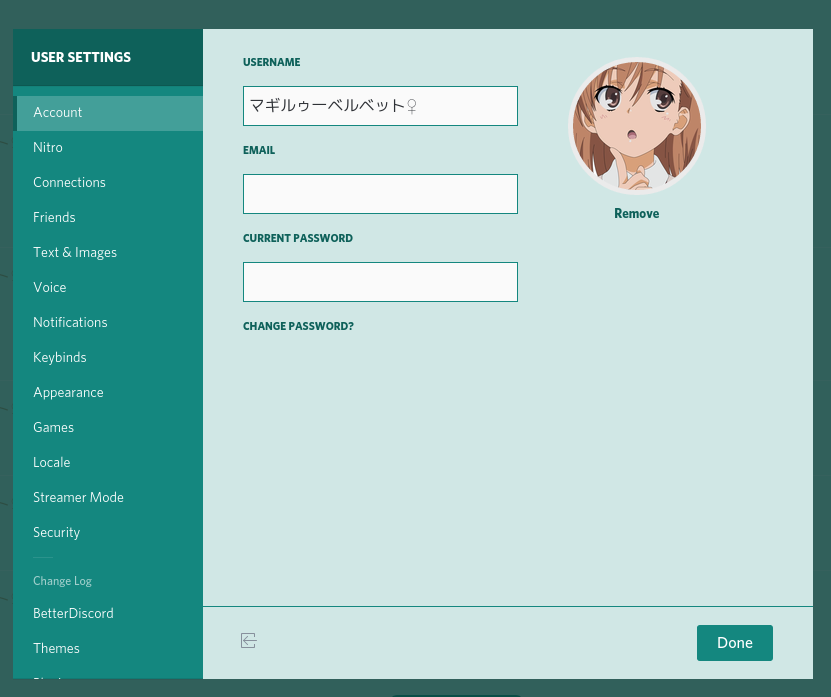

# Discord Theme: Dark Cyan Flat & Edgy

### Overview

 - Primary color `#14877f`
 - Flat (most "3D" effects removed)
 - Edgy (most rounded borders removed)
 - Slightly changes the original UI layout of Discord (mostly only sizes)
 - Easy on the eyes without using too dark colors

### Theme works with

 - Discord app (BetterDiscord or BeautifulDiscord required)
 - WebKit/Blink based browsers (Opera, Chrome, etc.)

Intentionally only written for the Discord app and **not** for web browsers! Don't ask for help or report bugs if you are not using the official client. Thanks for understanding.

### Usage

This theme was built on top of the **light theme** of Discord. To make it work as intended switch to the light theme first.
If you are not using BeautifulDiscord try to remove the first line which says `META` from the CSS if you encounter any problems.

### Screenshots

### Changelog

This theme is not yet finished and there are still some bugs due to bad CSS selections.
I'm still trying to understand the layout of Discord and how it works. Some things are
not yet themed and may look not very nice.

All the primary and most used UI elements are done though :smile:

#### v0.7.5.1

 - Fixed theme in BeautifulDiscord for real this time

#### v0.7.5

 - Increase emoji picker size  
   See `.emoji-picker .scroller` to set a custom size

#### v0.7.4

 - Clean up
 - BeautifulDiscord fixes
 - Fixed "Friends" button selected state background color

#### v0.7.3

 - Removed more rounded borders for even more edginess :D
 - Some fixes in the User Settings Dialog
 - Discord Changelog Dialog skinned

#### v0.7.2

 - Emoji Picker transparency fixes
 - Emoji auto-completer skinned
 - Hide "Welcome Message" (oversized and huge af heading in the primary text channel of each server)  
   Doesn't hide "beginning of" headings!

#### v0.7.1

 - User Profile Modal Dialog Header skinned
 - User Profile Pop-outs: Skinned `username` and `activity` (no longer blue)
 - Notification Settings skinned

#### v0.7

 - Initial public release

